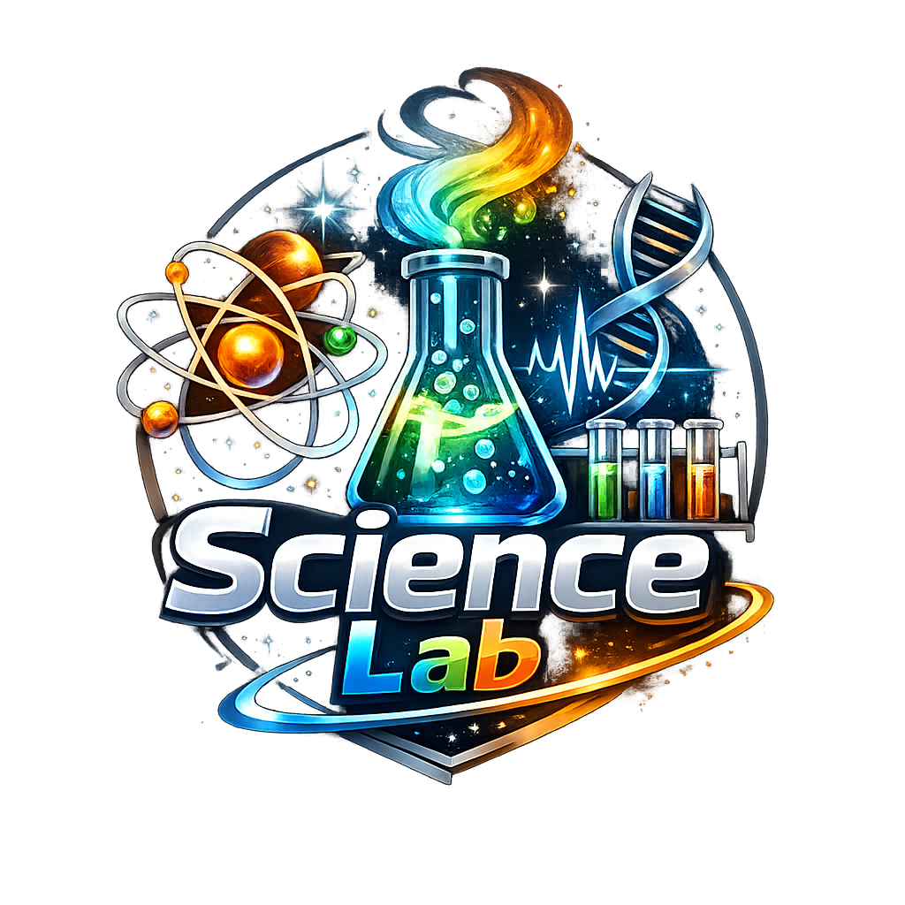
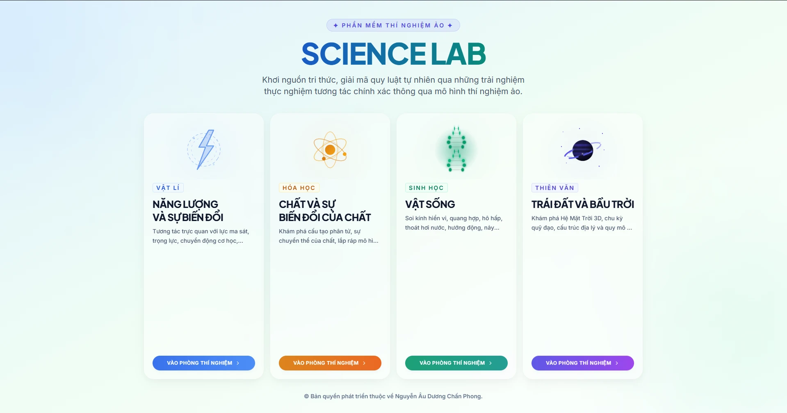
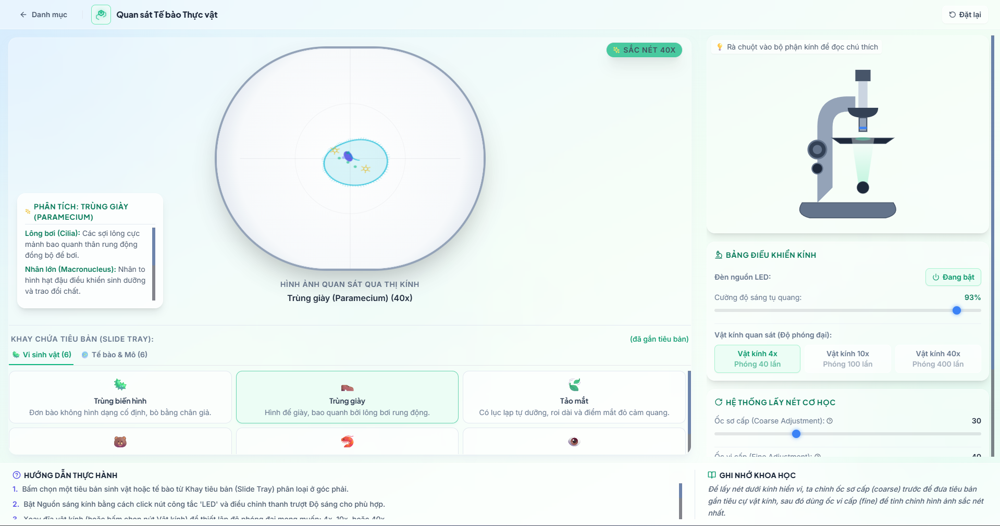
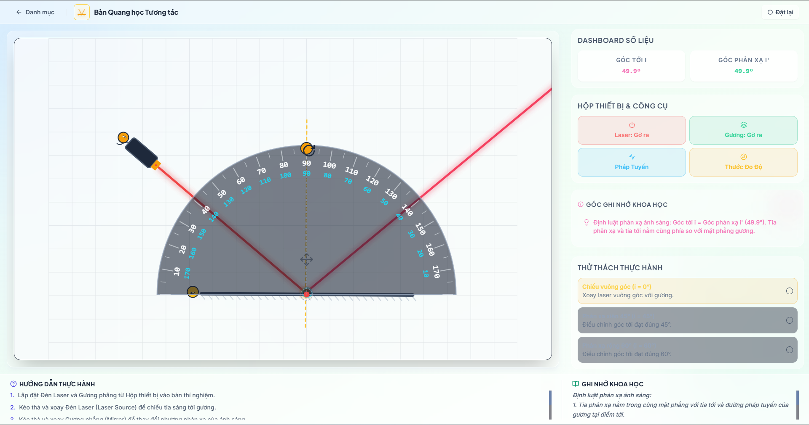

# 🧪 Phòng Thí Nghiệm Khoa Học Tự Nhiên Ảo

### *Virtual Science Lab*

**Mô phỏng thí nghiệm Khoa học Tự nhiên tương tác dành cho giáo viên và học sinh cấp THCS**

Vật lí · Hóa học · Sinh học · Thiên văn — hơn **50 thí nghiệm 3D** sinh động

 

 

## ⬇️ [**TẢI BẢN MỚI NHẤT**](../../releases/latest)

Chọn file phù hợp với hệ điều hành của bạn ở mục **Releases**

---

## ✨ Giới thiệu

**Science Lab** giúp học sinh THCS được "tự tay" làm thí nghiệm Khoa học Tự nhiên ngay trên máy tính — an toàn, trực quan và không tốn dụng cụ. Mỗi thí nghiệm được mô phỏng sinh động với hiệu ứng vật lí, hóa học và đồ thị thời gian thực, bám sát chương trình **Khoa học Tự nhiên 6–9**.

> 🎯 Học mà chơi — chơi mà hiểu bản chất khoa học.

---

## 🖼️ Giao diện

🏠 Màn hình chính — chọn chủ đề thí nghiệm theo môn

<table>
<tr>
<td width="50%" align="center">
 
<b>🔬 Kính hiển vi ảo</b> Quan sát tế bào & vi sinh vật, chỉnh độ phóng đại và lấy nét
</td>
<td width="50%" align="center">
 
<b>🔦 Bàn quang học</b> Chiếu laser, đo góc tới & góc phản xạ theo thời gian thực
</td>
</tr>
</table>

---

## 🔬 Nội dung thí nghiệm

<table>
<tr>
<td width="50%" valign="top">

### ⚛️ Chất & Sự Biến Đổi
Chuyển thể, cấu tạo nguyên tử, liên kết hóa học, phản ứng & năng lượng, bảo toàn khối lượng, nồng độ dung dịch, pH, tráng bạc, dãy hoạt động kim loại, phản ứng Biuret…

</td>
<td width="50%" valign="top">

### ⚡ Năng Lượng & Lực
Lực & ma sát, cân lò xo, vector lực, động học, âm thanh, quang học, gương phẳng, từ trường, khối lượng riêng, áp suất, đòn bẩy, cảm ứng điện từ, mạch điện…

</td>
</tr>
<tr>
<td width="50%" valign="top">

### 🌱 Vật Sống
Kính hiển vi, quang hợp, hô hấp ở hạt, thoát hơi nước, tính hướng, nảy mầm, enzyme, lưới thức ăn, di truyền Mendel, đột biến DNA, sơ cứu…

</td>
<td width="50%" valign="top">

### 🪐 Trái Đất & Bầu Trời
Hệ Mặt Trời 3D, chu kỳ ngày & đêm, các pha của Mặt Trăng và chuyển động quỹ đạo các hành tinh…

</td>
</tr>
</table>

… và nhiều thí nghiệm khác — tổng cộng <b>hơn 50 mô phỏng</b> tương tác.

---

## 💻 Tải về & Cài đặt

### 🪟 Windows
1. Tải file `VirtualScienceLab_x.x.x_x64-setup.exe` tại [**Releases**](../../releases/latest).
2. Chạy file và làm theo hướng dẫn cài đặt.
3. Nếu Windows SmartScreen hiện cảnh báo → bấm **More info → Run anyway**.

### 🍎 macOS
1. Tải file `VirtualScienceLab_x.x.x_universal.dmg` (chạy cho cả Intel & Apple Silicon).
2. Mở file `.dmg` và kéo app vào thư mục **Applications**.
3. Lần đầu mở: **chuột phải vào app → Open → Open** (để bỏ qua cảnh báo của macOS).

---

## 🔄 Tự động cập nhật

Ứng dụng **tự kiểm tra và cập nhật** lên phiên bản mới nhất mỗi khi khởi động — bạn không cần tải lại thủ công. Khi có bản mới, app sẽ tải ngầm và hỏi bạn cài đặt.

---

## 📋 Yêu cầu hệ thống

| | Tối thiểu |
|---|---|
| **Windows** | Windows 10/11 (64-bit) |
| **macOS** | macOS 10.15+ (Intel hoặc Apple Silicon) |
| **Màn hình** | Độ phân giải ≥ 1024×768 |

---

Made with ❤️ for Vietnamese students

**© Nguyễn Âu Dương Chấn Phong · Science Lab**

